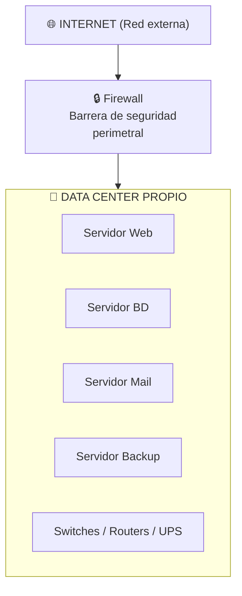
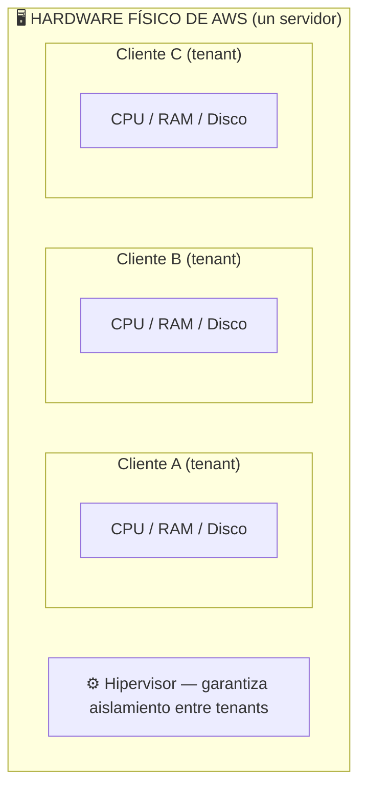

# Introducción: Del Servidor Físico a la Nube

Antes de entender qué es Cloud Computing y por qué transformó la industria, necesitamos entender
el modelo que vino a reemplazar: la infraestructura **On-Premise** (en las propias instalaciones).
Conocer sus limitaciones es la mejor forma de apreciar el problema que la nube resolvió.

---

# El Modelo Tradicional: On-Premise

Durante décadas, toda organización que necesitaba sistemas de información —desde un banco hasta
una empresa de logística— debía construir y mantener su propia infraestructura tecnológica.
Los servidores físicos eran de su propiedad, vivían dentro de sus instalaciones, y sobre ellos
se desplegaban todos los sistemas: bases de datos, aplicaciones web, sistemas de correo, ERP, y más.

El acceso desde el exterior funcionaba así: un cliente o usuario remoto enviaba una solicitud a través
de Internet (la red externa), esta solicitud atravesaba el firewall perimetral de la organización,
y finalmente llegaba al servidor que correspondía dentro del data center propio.

---

## Problemas del Modelo Tradicional

El modelo On-Premise funcionaba, pero a un costo altísimo en varios frentes.

### Inversión de capital elevada (CapEx)

Para operar, la organización debía adquirir y mantener toda la pila de infraestructura física.
Esto incluía: servidores (towers o rack), gabinetes y racks de montaje, cableado estructurado
(Cat6, fibra óptica), switches y routers, sistemas UPS (Uninterruptible Power Supply) para
protección eléctrica, aire acondicionado especializado de precisión, y sistemas de supresión
de incendios. Todo esto representaba un gasto de capital enorme **antes de escribir una sola
línea de código productivo**.

::: warning CapEx vs OpEx
**CapEx** (Capital Expenditure) son inversiones en activos de largo plazo. Comprar un servidor
es CapEx: pagas hoy, el activo se deprecia en años, y necesitas reservas de capital para hacerlo.
Esto es un problema para startups o proyectos nuevos que necesitan escalar rápido sin liquidez inicial.
:::

### Logística y mantenimiento continuo

Mantener un data center propio no es solo cuestión de hardware. Implica una operación logística
permanente: equipos de administración de sistemas disponibles 24/7, contratos de mantenimiento
preventivo con fabricantes, gestión del ciclo de vida del hardware (un servidor tiene una vida
útil de 3 a 5 años y luego debe reemplazarse), y planificación de actualizaciones que muchas veces
requieren ventanas de mantenimiento con interrupción del servicio.

Existe además una **dependencia geográfica crítica**: si el data center está en la Ciudad de México
y la empresa abre una oficina en Bogotá, los usuarios colombianos experimentarán latencia alta
porque cada solicitud viaja miles de kilómetros de ida y vuelta. Escalar geográficamente en
On-Premise significa abrir un nuevo data center físico en cada ciudad — un proyecto de meses y
millones de dólares.

### Ciberseguridad: una responsabilidad total

En el modelo On-Premise, la organización es **completamente responsable** de la seguridad en
todos los niveles: seguridad física del recinto (control de acceso, cámaras, guardias), seguridad
de red (firewalls, IDS/IPS, segmentación de VLANs), seguridad del sistema operativo (parches,
hardening), seguridad de las aplicaciones, y cumplimiento normativo (ISO 27001, PCI-DSS, etc.).

Esto requiere un equipo de ciberseguridad dedicado, herramientas especializadas, y una vigilancia
constante — todo a cargo y costo de la organización.

---

## ¿Qué llevó al Modelo Cloud?

El detonante no fue un solo problema, sino la acumulación de todos los anteriores chocando con
una nueva realidad de mercado: **la velocidad de innovación tecnológica se aceleró exponencialmente**.

Las empresas necesitaban lanzar productos en semanas, no en meses. Necesitaban escalar de 100 a
100,000 usuarios sin previo aviso. Necesitaban presencia global sin construir data centers en cada
continente. Y necesitaban todo eso sin inmovilizar capital en infraestructura física.

Fue en ese contexto donde surgió una idea disruptiva: **¿y si la infraestructura fuera un servicio
que se consume como el agua o la electricidad?** Pagas por lo que usas, cuando lo usas, y alguien
más se encarga de que siempre esté disponible.

---

# El Modelo Cloud: ¿Qué es Cloud Computing?

> *"Cloud computing es un modelo que permite el acceso ubicuo, conveniente y bajo demanda a través
> de la red a un conjunto compartido de recursos de computación configurables (redes, servidores,
> almacenamiento, aplicaciones y servicios) que pueden ser aprovisionados y liberados rápidamente
> con un mínimo esfuerzo de gestión o interacción con el proveedor del servicio."*
>
> — **NIST** (National Institute of Standards and Technology), Definición SP 800-145

::: info ¿Qué es el NIST?
El **NIST** (National Institute of Standards and Technology, Instituto Nacional de Estándares
y Tecnología) es una agencia del gobierno de los Estados Unidos fundada en 1901. Su misión es
desarrollar estándares tecnológicos que promueven la innovación y la competitividad industrial.
En el mundo de Cloud Computing, el documento **NIST SP 800-145** es la referencia internacional
más citada para definir qué es y qué no es la nube. Puedes consultarlo en:
[nvlpubs.nist.gov/nistpubs/Legacy/SP/nistspecialpublication800-145.pdf](https://nvlpubs.nist.gov/nistpubs/Legacy/SP/nistspecialpublication800-145.pdf)
:::

En palabras más simples: Cloud Computing es la entrega de recursos de TI (servidores, almacenamiento,
bases de datos, redes, software) **a través de Internet**, **bajo demanda**, con **pago por uso**.
En lugar de poseer la infraestructura, la alquilas al instante desde un proveedor que la opera a escala global.

---

## Historia del Cloud Computing

La historia de la nube no empieza con AWS en 2006. Sus raíces conceptuales son más antiguas.

**1960s** — El concepto de "utility computing" aparece por primera vez. John McCarthy sugiere que
la computación podría organizarse como un servicio público, igual que el agua o la electricidad.

**1999** — Salesforce lanza el primer SaaS (Software as a Service) comercial a escala: CRM
entregado completamente por el navegador, sin instalaciones locales. Demuestra que el software
puede vivir en la nube y ser viable como negocio.

**2002** — Amazon lanza Amazon Web Services inicialmente como una plataforma interna. La empresa
había construido infraestructura masiva para soportar su e-commerce y descubrió que podía
monetizarla ofreciéndola a terceros.

**2006** — AWS lanza públicamente **EC2** (Elastic Compute Cloud) y **S3** (Simple Storage Service),
los dos servicios que marcan el nacimiento del IaaS moderno. Cualquier persona puede alquilar
un servidor virtual en minutos con una tarjeta de crédito.

**2008-2010** — Google App Engine y Microsoft Azure entran al mercado. El cloud deja de ser
exclusivo de AWS y se convierte en una industria.

**2010s en adelante** — Explosión de servicios: contenedores (Docker, Kubernetes), serverless
(AWS Lambda), Machine Learning gestionado, edge computing. El cloud se convierte en la
infraestructura por defecto de la industria tecnológica global.

---

## Las 5 Características Esenciales del Cloud

El NIST define con precisión cinco características que **todo** servicio cloud debe cumplir.
Si un servicio no cumple estas cinco, técnicamente no es cloud — es hosting tradicional con otro nombre.

### 1. On-Demand Self-Service (Autoservicio Bajo Demanda)

Un usuario puede aprovisionar recursos de cómputo — servidores, almacenamiento, bases de datos —
**de forma unilateral y automática**, sin necesidad de interacción humana con el proveedor.

En la práctica: entras a la consola de AWS, haces clic en "Launch Instance", y en 90 segundos
tienes un servidor funcionando. Nadie del equipo de AWS aprobó tu solicitud, nadie configuró
hardware manualmente. El proceso es completamente automatizado.

Esto contrasta radicalmente con el modelo On-Premise, donde aprovisionar un servidor nuevo
implicaba una orden de compra, entrega del hardware (semanas), instalación en el rack, configuración
de red, e instalación del sistema operativo — un proceso que podía tomar de 2 a 8 semanas.

### 2. Broad Network Access (Acceso Amplio a la Red)

Los recursos y servicios cloud están disponibles **a través de la red** y se accede a ellos mediante
mecanismos estándar (HTTP/S, SSH, APIs REST) desde cualquier tipo de dispositivo: laptops, teléfonos,
tablets, dispositivos IoT, o incluso otros servicios cloud.

No existe dependencia de una red privada especial ni de un cliente propietario. Si tienes
conexión a Internet y las credenciales correctas, puedes administrar tu infraestructura cloud
desde cualquier lugar del mundo.

### 3. Resource Pooling (Agrupación de Recursos)

Los recursos del proveedor se **agrupan en un pool compartido** para servir a múltiples clientes
simultáneamente. Los recursos físicos (servidores, almacenamiento, ancho de banda) se asignan
y reasignan dinámicamente según la demanda de cada cliente, sin que ninguno de ellos sepa
exactamente en qué hardware físico está corriendo su carga de trabajo.

#### El modelo Multi-Tenant

Este concepto de pool compartido da origen al **modelo multi-tenant** (multi-inquilino), que es
el fundamento económico del cloud. Imagina un edificio de apartamentos: el edificio (hardware físico)
es del propietario (AWS), y múltiples inquilinos (clientes) viven en él de forma aislada y
simultánea. Cada inquilino tiene su propio espacio, no puede ver el del vecino, pero todos
comparten la infraestructura del edificio (ascensores, tuberías, electricidad).

El aislamiento entre tenants lo garantiza el **hipervisor** — software que virtualiza el hardware
y asegura que ningún cliente pueda acceder a los datos o recursos del otro, aunque compartan
el mismo servidor físico.

::: tip ¿Por qué multi-tenant es bueno para el precio?
Porque permite a AWS amortizar el costo de un servidor físico entre decenas de clientes,
y pasarte esas economías de escala en forma de precios muy bajos. Un servidor que cuesta
$10,000 y sirve a 50 clientes equivale a $200 por cliente — inaccesible comprarlo, pero
barato alquilarlo.
:::

### 4. Rapid Elasticity (Elasticidad Rápida)

Los recursos pueden **escalarse hacia arriba o hacia abajo de forma rápida y automática**,
en algunos casos de manera elástica, para alinearse con la demanda real en cada momento.

Desde la perspectiva del cliente, los recursos disponibles parecen ilimitados: puedes pasar
de 2 servidores a 200 en minutos si tu tráfico se dispara, y volver a 2 cuando el pico termina.
Pagas solo por los 200 durante el tiempo que los necesitaste.

Este es el superpoder que hace inviable al modelo On-Premise para cargas variables: si un
e-commerce On-Premise se dimensiona para el Black Friday, tiene capacidad ociosa los otros
364 días del año. En cloud, escala para el Black Friday y paga solo esas horas.

### 5. Measured Service (Servicio Medido)

Los sistemas cloud **monitorean, controlan y reportan el uso de recursos** de forma transparente,
tanto para el proveedor como para el cliente. El consumo se mide con precisión: horas de cómputo,
gigabytes almacenados, millones de solicitudes procesadas, gigabytes de datos transferidos.

El resultado es el modelo **pay-as-you-go** (pago por uso): solo pagas exactamente por lo que
consumes, con la granularidad de segundos en algunos servicios. No hay contratos de capacidad
mínima (salvo que los quieras para obtener descuentos), no hay sobrecargos por capacidad no usada.

::: info Las 5 características en resumen
| # | Característica | Qué garantiza |
|---|---|---|
| 1 | On-Demand Self-Service | Aprovisionar recursos sin intervención humana del proveedor |
| 2 | Broad Network Access | Acceso desde cualquier dispositivo vía red estándar |
| 3 | Resource Pooling | Infraestructura compartida con aislamiento (multi-tenant) |
| 4 | Rapid Elasticity | Escalar hacia arriba o abajo según demanda, automáticamente |
| 5 | Measured Service | Pago exacto por lo consumido, sin desperdicios |
:::
