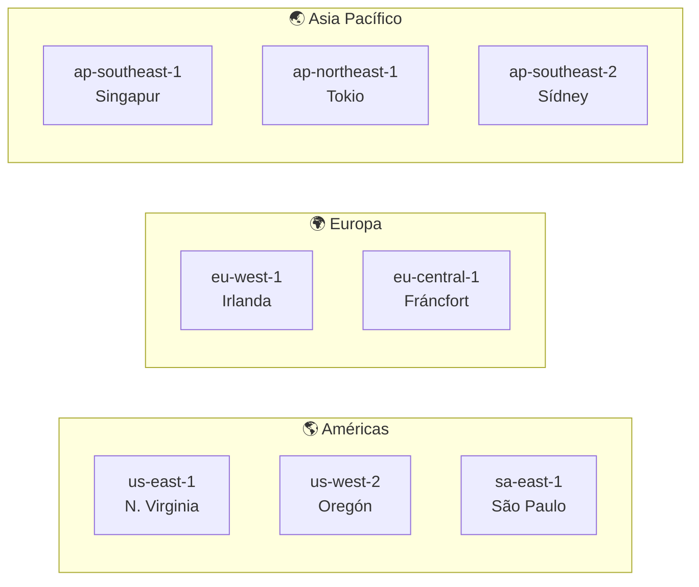
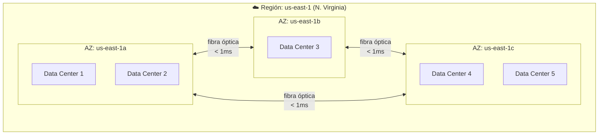
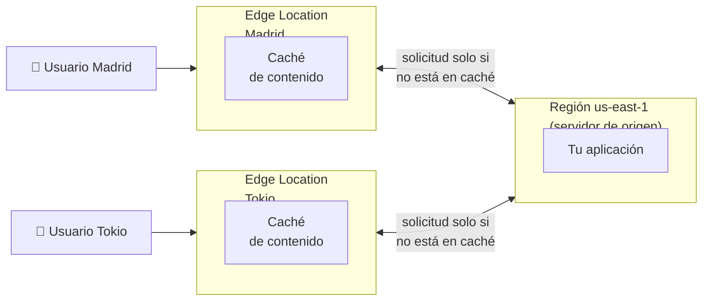

# Introducción y Fundamentos de AWS

Amazon Web Services no surgió como un producto planificado para el mercado. Surgió de una necesidad
interna: Amazon el e-commerce necesitaba infraestructura escalable para sus propias operaciones, la
construyó, y en 2006 se dio cuenta de que podía ofrecerla al mundo como servicio. Lo que comenzó
como dos servicios (EC2 y S3) es hoy la plataforma cloud más grande del planeta, con más de 200
servicios que cubren desde cómputo básico hasta inteligencia artificial, IoT y computación cuántica.

---

# ¿Qué es AWS?

AWS no es una herramienta, es un **ecosistema de más de 200 servicios** administrados que permiten
construir, desplegar y operar prácticamente cualquier tipo de sistema o aplicación en la nube,
sin necesidad de gestionar infraestructura física. Estos servicios se agrupan en categorías
según su propósito:

**Cómputo** — El núcleo de AWS. Aquí vive EC2 (máquinas virtuales), Lambda (funciones serverless
que se ejecutan bajo demanda sin gestionar servidores) y ECS/EKS (orquestación de contenedores).
Es donde corre el código de tus aplicaciones.

**Bases de Datos** — AWS ofrece motores relacionales con RDS (PostgreSQL, MySQL, Oracle) y su
versión propia Aurora, NoSQL con DynamoDB, caché en memoria con ElastiCache y almacenamiento de
datos masivo con Redshift. Cada motor está optimizado para un caso de uso diferente.

**Redes** — VPC (Virtual Private Cloud) te da tu propio espacio de red aislado dentro de AWS.
Route 53 es el DNS, CloudFront el CDN global y el Application Load Balancer distribuye el tráfico
entre tus servidores automáticamente.

**Seguridad e Identidad** — IAM gestiona quién puede hacer qué dentro de tu cuenta. KMS maneja
el cifrado de datos, GuardDuty detecta amenazas con machine learning y WAF protege tus aplicaciones
web de ataques comunes.

**Machine Learning e IA** — SageMaker permite entrenar y desplegar modelos de ML sin gestionar
infraestructura. Rekognition analiza imágenes, Transcribe convierte voz a texto y Bedrock da acceso
a modelos de lenguaje de terceros como los de Anthropic.

**IoT y Edge** — IoT Core conecta y gestiona millones de dispositivos físicos, mientras que
Greengrass lleva la capacidad de cómputo hasta el borde de la red (edge computing), procesando
datos directamente en el dispositivo sin depender de la nube central.

La ventaja de tener todo esto bajo un mismo techo no es trivial. Cuando construyes en AWS, todos
tus servicios comparten la misma red privada, el mismo sistema de identidad (IAM), el mismo modelo
de facturación y las mismas herramientas de monitoreo. Conectar una base de datos con un servidor,
una función serverless con una cola de mensajes, o una aplicación web con un sistema de caché son
operaciones de minutos — no proyectos de integración de semanas.

## ¿Por Qué AWS y No Otro Proveedor?

El mercado de cloud tiene tres actores principales: AWS, Microsoft Azure y Google Cloud Platform (GCP).
Cada uno tiene sus fortalezas y su público natural.

| Proveedor | Fortaleza principal | Público natural |
|---|---|---|
| **AWS** | Amplitud de servicios, madurez, ecosistema | Startups, empresas cloud-native, cualquier industria |
| **Microsoft Azure** | Integración con ecosistema Microsoft (Office 365, Active Directory, .NET) | Empresas corporativas con infraestructura Microsoft existente |
| **Google Cloud (GCP)** | Machine Learning, Big Data (BigQuery), Kubernetes (lo inventaron) | Empresas con cargas analíticas intensivas o equipos de ML |

AWS lidera el mercado con una cuota cercana al **31%**, seguido por Azure (~25%) y GCP (~11%),
según datos de Synergy Research Group (Q1 2024). La ventaja de AWS no es solo de tamaño — es
de **tiempo en el mercado**: lleva más de una década de ventaja sobre sus competidores, lo que
se traduce en mayor madurez de servicios, más documentación, más comunidad y más profesionales
certificados disponibles.

::: tip Referencias de mercado
- Cuotas de mercado cloud actualizadas: [Synergy Research Group](https://www.srgresearch.com/articles/cloud-market-share)
- Comparativa de servicios entre proveedores: [cloudcomparison.io](https://cloudcomparison.io)
:::

---

## Costos por Consumo: El Modelo de Precios de AWS

### Pay-as-you-go: Pago por Uso

El modelo base de AWS es **pay-as-you-go** (paga mientras usas). No hay contratos obligatorios,
no hay licencias anuales, no hay capacidad mínima comprometida. Consumes un recurso, AWS lo mide
con precisión, y te cobra exactamente por lo que usaste.

La unidad de medida varía según el tipo de servicio, porque medir el "uso" de una base de datos
no es lo mismo que medir el uso de un servidor o de una red:

| Categoría | Servicio ejemplo | ¿Cómo se mide el uso? |
|---|---|---|
| Cómputo | EC2 | Por hora o segundo de instancia encendida |
| Almacenamiento | S3 | Por GB almacenado al mes + número de requests |
| Base de datos | RDS | Por hora de instancia + GB de almacenamiento |
| Redes | Data Transfer | Por GB de datos que salen de AWS hacia Internet |
| Serverless | Lambda | Por número de invocaciones + GB·segundo de ejecución |

AWS construye sus precios a partir de sus propias economías de escala: opera cientos de miles
de servidores físicos y compra hardware, electricidad y espacio físico a volúmenes que ninguna
empresa individual podría alcanzar. Eso le permite ofrecer precios unitarios muy bajos y,
adicionalmente, los reduce año tras año a medida que sus costos operativos bajan.

::: info Calculadora de costos oficial de AWS
Antes de lanzar cualquier arquitectura, estima tu gasto mensual en la calculadora oficial:
[calculator.aws/pricing/2/home](https://calculator.aws/pricing/2/home)
Permite simular combinaciones de servicios y ver el costo proyectado.
:::

### El Problema del Sobrecosto por Mala Configuración

El modelo pay-as-you-go tiene una trampa que sorprende a muchos principiantes: **si configuras
mal un recurso, la factura crece silenciosamente**. Algunos escenarios frecuentes:

- Dejar una instancia EC2 encendida 24/7 cuando solo la necesitas en horario de oficina.
- Almacenar datos en S3 sin política de ciclo de vida, acumulando GBs indefinidamente.
- Configurar un NAT Gateway para tráfico que no lo requiere (uno de los costos ocultos más comunes).
- Transferir datos entre regiones sin anticipar el costo de egress (salida de datos).

::: warning Cómo protegerte del sobrecosto
**AWS Budgets** — configura alertas que te notifican por email cuando tu gasto supera un umbral definido.
**AWS Cost Explorer** — visualiza en qué servicio y en qué región estás gastando más.
**AWS Trusted Advisor** — detecta recursos infrautilizados o mal configurados automáticamente.

Referencia oficial: [aws.amazon.com/aws-cost-management](https://aws.amazon.com/aws-cost-management/)
:::

### Ventajas del Modelo de Cobro por Uso

El pay-as-you-go resuelve problemas estructurales del modelo On-Premise. Elimina la necesidad de
predecir la capacidad futura: no tienes que comprar servidores para el peor escenario posible y
pagar por ellos aunque ese escenario nunca llegue. Transforma el gasto de capital (CapEx) en gasto
operacional (OpEx), lo que libera capital para el negocio y simplifica la contabilidad. Y permite
experimentar sin riesgo: puedes lanzar un prototipo, probar, y apagarlo sin haber comprometido
inversión en hardware.

### Otros Modelos de Pago

Además del pay-as-you-go, AWS ofrece modelos alternativos que permiten ahorrar a cambio de compromiso:

**Instancias Reservadas (Reserved Instances)** — Te comprometes a usar un tipo de instancia EC2
específico durante 1 o 3 años, a cambio de descuentos de hasta el 72% frente al precio On-Demand.
Ideal para cargas de trabajo estables y predecibles como servidores de producción que corren 24/7.

**Savings Plans** — Similar a las Reserved Instances pero más flexible: te comprometes a un gasto
mínimo por hora (por ejemplo $10/hora) y el descuento aplica a cualquier instancia que uses hasta
ese monto, sin importar el tipo o la región.

**Spot Instances** — AWS vende su capacidad de cómputo no utilizada a precios hasta un 90% más
baratos que On-Demand. El catch: AWS puede recuperar esa capacidad con solo 2 minutos de aviso
si la necesita para otro cliente.

::: tip Analogía: Spot Instances como vuelos en standby
Las Spot Instances funcionan como los vuelos en *standby* de las aerolíneas: consigues el pasaje
a un precio increíblemente bajo, pero si el vuelo se llena con pasajeros de precio completo,
te bajan del avión. Son perfectas para trabajos que pueden interrumpirse y reanudarse: procesamiento
de imágenes por lotes, entrenamiento de modelos de ML, renderizado de video. Nunca las uses para
tu base de datos de producción o para sesiones de usuarios activos.
:::

### Free Tier: Experimenta Sin Gastar

AWS ofrece una capa gratuita (**Free Tier**) con tres modalidades:

- **Siempre gratis** — Recursos con límite de uso mensual que nunca caducan. Ejemplo: 1 millón de
  invocaciones de Lambda al mes, siempre gratis.
- **12 meses gratis** — Para cuentas nuevas, acceso gratuito a servicios clave durante el primer año.
  Ejemplo: 750 horas/mes de EC2 t2.micro o t3.micro.
- **Pruebas de corto plazo** — Acceso gratuito por tiempo limitado a servicios específicos para
  que puedas evaluarlos.

::: info Free Tier oficial
Consulta todos los servicios incluidos y sus límites exactos:
[aws.amazon.com/free](https://aws.amazon.com/free/)
:::

---

## Regiones y Zonas de Disponibilidad

Para entender cómo AWS garantiza alta disponibilidad y resiliencia a escala global, es necesario
comprender cómo organiza su infraestructura geográficamente. Este es un concepto **transversal**:
cada servicio que uses en AWS existe dentro de una región, y la mayoría permite distribuirse entre
zonas de disponibilidad. No es un detalle técnico — es una decisión de arquitectura que afecta
directamente la resiliencia, la latencia y el costo de tus sistemas.

### Resiliencia: El Principio que Guía el Diseño

**Resiliencia** es la capacidad de un sistema de absorber fallos y continuar operando, o recuperarse
rápidamente cuando algo falla. En infraestructura cloud, esto se traduce en una pregunta concreta:
¿qué pasa con tu aplicación si un data center completo pierde energía esta noche?

AWS construyó su infraestructura geográfica precisamente para responder esa pregunta con "nada,
sigue funcionando" — pero solo si el arquitecto diseñó el sistema teniendo esto en cuenta.

### Regiones

Una **región** es una ubicación geográfica independiente que contiene múltiples data centers
agrupados. Cada región es un entorno completamente aislado del resto: tiene su propia
infraestructura eléctrica, su propia red troncal y sus propios servicios. Los datos que
almacenas en una región **no se mueven a otra región automáticamente** — tú decides si los replicas.

Este aislamiento no es solo técnico, también es legal: si tu empresa opera en Europa y el GDPR
exige que los datos de ciudadanos europeos no salgan del territorio europeo, simplemente usas
una región europea (`eu-west-1` en Irlanda o `eu-central-1` en Frankfurt) y AWS garantiza que
esos datos no abandonan esa región.

#### Distribución Geográfica

AWS tiene presencia en todos los continentes habitados y sigue expandiéndose. A 2024, opera más
de 33 regiones geográficas con más de 105 zonas de disponibilidad.



::: info Mapa de infraestructura global de AWS
Consulta el mapa interactivo con todas las regiones, AZs y Edge Locations actuales:
[aws.amazon.com/about-aws/global-infrastructure](https://aws.amazon.com/about-aws/global-infrastructure/)
:::

#### Nomenclatura de Regiones

AWS usa un sistema de nombres consistente para identificar sus regiones:

```
    us   -   east   -   1
    │           │        │
    │           │        └─ Número de región dentro del área (1 = la primera)
    │           └─ Dirección geográfica: east, west, north, south, central
    └─ Código de país o área: us, eu, ap, sa, ca, me, af
```

| Prefijo | Área geográfica |
|---|---|
| `us-` | Estados Unidos |
| `eu-` | Europa |
| `ap-` | Asia Pacífico |
| `sa-` | Sudamérica |
| `ca-` | Canadá |
| `me-` | Medio Oriente |
| `af-` | África |

::: info Nomenclatura oficial completa
Lista oficial de todas las regiones y sus códigos:
[docs.aws.amazon.com/general/latest/gr/rande.html](https://docs.aws.amazon.com/general/latest/gr/rande.html)
:::

### Zonas de Disponibilidad (Availability Zones)

Una **Availability Zone** (AZ, zona de disponibilidad) es uno o más data centers físicos dentro
de una región, con infraestructura eléctrica, de red y de refrigeración completamente independiente
de las otras AZs de la misma región.

La diferencia con una región es de escala y propósito: la región agrupa varias AZs bajo un mismo
paraguas geográfico; las AZs dentro de una región están físicamente separadas (kilómetros de distancia)
pero conectadas por fibra óptica de ultra-baja latencia (menos de 1ms entre ellas).



El propósito de las AZs es la **resiliencia dentro de una región**: si un incendio, una inundación
o un corte eléctrico afecta la AZ `us-east-1a`, las AZs `us-east-1b` y `us-east-1c` siguen
operando sin interrupción. Si tu aplicación está distribuida entre las tres AZs (que es la buena
práctica), tus usuarios no notan nada.

#### ¿Cómo Escoger una Zona de Disponibilidad?

En la práctica, no eliges una AZ — eliges un **conjunto de AZs** para distribuir tu carga de
trabajo. Pero sí existen criterios para elegir qué región y qué configuración de AZs usar:

**Latencia** — Despliega en la región más cercana a tu base de usuarios. Un usuario en Bogotá
tendrá mejor experiencia con `sa-east-1` (São Paulo) que con `us-east-1` (Virginia). Puedes
medir la latencia a cada región desde tu ubicación en:
[cloudping.info](https://cloudping.info)

**Resiliencia** — Siempre distribuye componentes críticos (servidores web, bases de datos) entre
al menos dos AZs. Una arquitectura en una sola AZ no es resiliente — es un punto único de fallo.

**Compliance y Soberanía de Datos** — Si operas bajo regulaciones que exigen que los datos
permanezcan en un territorio específico (GDPR en Europa, LGPD en Brasil, etc.), elige la región
que cumpla ese requisito. AWS garantiza que los datos no salen de la región sin tu autorización explícita.

**Disponibilidad de Servicios** — No todos los servicios nuevos de AWS llegan a todas las regiones
simultáneamente. `us-east-1` (N. Virginia) y `eu-west-1` (Irlanda) son históricamente las primeras
en recibir nuevas funcionalidades. Si necesitas un servicio específico, verifica su disponibilidad en:
[aws.amazon.com/about-aws/global-infrastructure/regional-product-services](https://aws.amazon.com/about-aws/global-infrastructure/regional-product-services/)

### Edge Locations

Además de regiones y AZs, AWS opera más de **400 Edge Locations** distribuidas globalmente.
No son regiones completas — son puntos de presencia más pequeños cuyo propósito es acercar
el contenido al usuario final para reducir la latencia al mínimo.

El servicio principal que aprovecha las Edge Locations es **Amazon CloudFront** (CDN —
Content Delivery Network, red de distribución de contenidos). Cuando un usuario en Madrid
solicita una imagen de tu aplicación alojada en `us-east-1`, CloudFront sirve esa imagen
desde la Edge Location de Madrid en lugar de viajar hasta Virginia — reduciendo la latencia
de ~100ms a ~5ms.



::: tip Infraestructura global — referencia clave
Guarda este enlace: es el mapa oficial con todas las regiones, AZs y Edge Locations de AWS,
actualizado en tiempo real:
[aws.amazon.com/about-aws/global-infrastructure](https://aws.amazon.com/about-aws/global-infrastructure/)
:::
