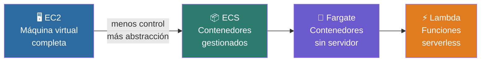
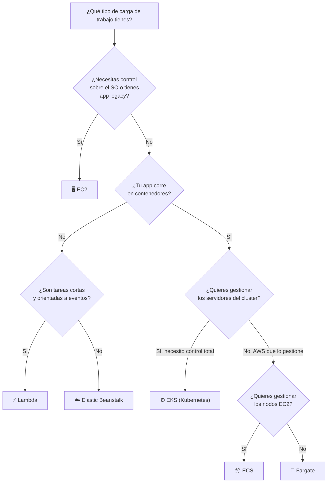
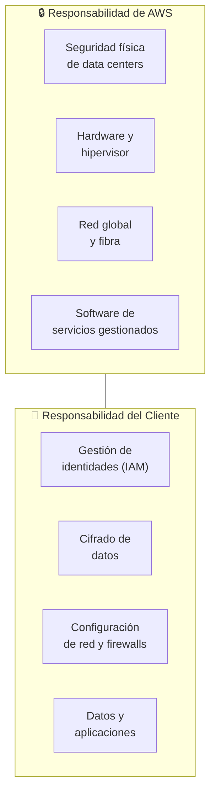
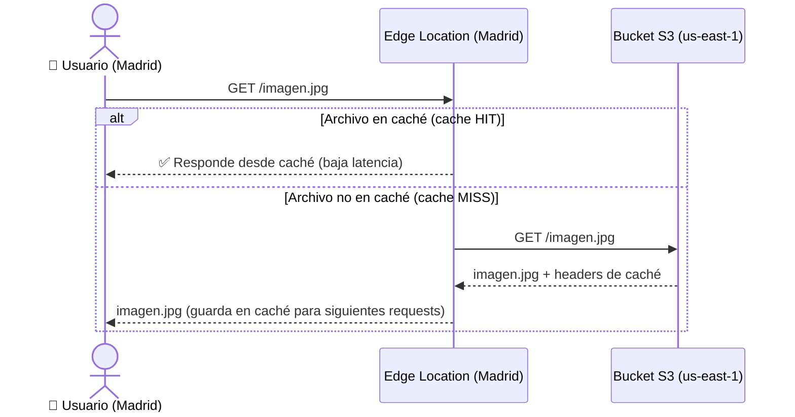

# Servicios de AWS por Categoría

AWS no es un producto único — es un ecosistema de más de 200 servicios especializados que cubren
prácticamente cualquier necesidad de infraestructura tecnológica. Cada servicio existe para resolver
un problema específico, y la potencia real de AWS está en combinarlos. En este capítulo recorremos
las categorías principales, entendiendo para qué sirve cada servicio, cuándo usarlo y cuál elegir
frente a sus alternativas dentro de la misma plataforma.

---

# Servicios de Cómputo en AWS

Los servicios de cómputo son el corazón de AWS: son los que ejecutan el código de tus aplicaciones.
Si la infraestructura cloud fuera una cocina, los servicios de cómputo serían los fogones — sin ellos,
nada pasa. La diferencia entre los distintos servicios de cómputo no es si funcionan o no, sino
**cuánto control tienes sobre ellos** y, en consecuencia, cuánto debes gestionar tú mismo.

## El Espectro de Control en los Servicios de Cómputo

Los servicios de cómputo de AWS pueden ordenarse a lo largo de un eje que va desde el máximo
control (y máxima responsabilidad de gestión) hasta la máxima abstracción (y máxima delegación
a AWS). Entender este espectro es clave para elegir el servicio correcto según el problema.

| | EC2 | ECS | Fargate | Lambda |
|---|---|---|---|---|
| **Gestionas el SO** | ✅ Tú | ❌ AWS | ❌ AWS | ❌ AWS |
| **Gestionas el servidor** | ✅ Tú | ✅ Tú | ❌ AWS | ❌ AWS |
| **Escalado** | Manual / Auto Scaling | Automático | Automático | Automático instantáneo |
| **Unidad de pago** | Por hora de instancia | Por hora de instancia | Por vCPU·s y GB·s | Por invocación + ms de ejecución |
| **Tiempo de arranque** | ~1-3 minutos | Segundos | Segundos | Milisegundos |

### EC2 — Elastic Compute Cloud

EC2 es una máquina virtual completa en la nube. Cuando lanzas una instancia EC2, obtienes un
servidor con su sistema operativo (Linux, Windows), su disco, su interfaz de red y su IP — exactamente
como un servidor físico, pero virtualizado. Tú decides qué SO instalar, qué software configurar,
cómo aplicar parches de seguridad y cómo gestionarlo día a día.

Este nivel de control lo hace ideal para **aplicaciones legacy** — sistemas construidos hace años
que asumen un entorno de sistema operativo específico, que usan configuraciones a nivel de kernel
o que dependen de software que no existe como contenedor. También es la opción cuando necesitas
acceso SSH directo al servidor o cuando debes cumplir requisitos de configuración muy específicos
que un servicio más abstracto no permite.

La contrapartida es la gestión: actualizaciones, monitoreo, hardening de seguridad, backups del
sistema operativo — todo cae del lado del cliente.

### ECS — Elastic Container Service

ECS es el servicio de orquestación de contenedores de AWS. Antes de entender ECS, conviene tener
claro qué es la **orquestación**: cuando una aplicación se divide en múltiples contenedores
(por ejemplo, uno para la API, otro para el procesador de tareas, otro para el worker de emails),
necesitas un sistema que los inicie, los detenga, los distribuya entre servidores, detecte cuándo
uno falla y lo reinicie automáticamente, y escale el número de réplicas según la carga. Eso es
orquestación — coordinar la vida y el comportamiento de múltiples contenedores como si fueran
un sistema unificado.

ECS hace exactamente eso, pero sin la complejidad de Kubernetes. Es una versión simplificada que
cubre la mayoría de los casos de orquestación sin requerir el aprendizaje profundo que Kubernetes
exige. No tiene las capacidades avanzadas de Kubernetes (como Custom Resource Definitions o
configuraciones de red muy granulares), pero para arquitecturas de microservicios estándar,
es perfectamente suficiente y mucho más fácil de operar.

ECS es especialmente útil para sistemas con **alta estacionalidad** — aplicaciones cuya carga
no es constante sino que sigue patrones predecibles: un e-commerce que duplica el tráfico
los viernes por la noche, un sistema de nómina que procesa masivamente los días 15 y 30,
o una app de reservas que se dispara los lunes por la mañana. En ECS puedes configurar rangos
de réplicas (mínimo 2, máximo 20) y programar el escalado según horarios conocidos, pagando
solo por la capacidad que usas en cada momento.

### Fargate — Contenedores sin Servidor

Fargate es una modalidad de ejecución para ECS (y EKS) que elimina la necesidad de gestionar
los servidores subyacentes donde corren los contenedores. Con ECS estándar, tú decides cuántas
instancias EC2 forman el cluster donde viven los contenedores — y debes gestionarlas. Con Fargate,
AWS gestiona ese cluster por ti: simplemente defines cuánta CPU y memoria necesita tu contenedor,
y Fargate lo ejecuta en la infraestructura que considere adecuada, de forma completamente transparente.

Es el punto intermedio entre la gestión total de EC2 y la abstracción total de Lambda: tienes
contenedores (con todo lo que eso implica en términos de empaquetado de código y dependencias),
pero sin preocuparte por los servidores que los ejecutan.

### Lambda — Funciones Serverless

Lambda lleva la abstracción al extremo: no hay servidores, no hay contenedores, no hay instancias.
Solo subes una función — un fragmento de código que hace una cosa específica — y AWS la ejecuta
cada vez que ocurre un evento: una solicitud HTTP, un archivo subido a S3, un mensaje en una
cola, un cambio en una base de datos, o incluso un cron job.

La razón por la que Lambda escala más rápido que EC2 o ECS es fundamental: no necesita levantar
una máquina virtual ni un contenedor. Cuando llega una invocación, AWS simplemente ejecuta el
código en un entorno de ejecución preexistente (un microVM ya caliente) que tarda milisegundos
en responder. Si llegan 10,000 invocaciones simultáneas, Lambda lanza 10,000 entornos de ejecución
en paralelo de forma automática, sin ninguna configuración previa. Según la documentación oficial
de AWS, Lambda puede escalar hasta 10,000 ejecuciones concurrentes por región por defecto,
y ese límite puede aumentarse bajo solicitud.

::: info Documentación oficial de Lambda
Límites y comportamiento de escalado: [docs.aws.amazon.com/lambda/latest/dg/lambda-concurrency.html](https://docs.aws.amazon.com/lambda/latest/dg/lambda-concurrency.html)
:::

La desventaja de Lambda es el costo en ejecuciones largas. El modelo de precios cobra por
cada invocación más por el tiempo de ejecución en GB·segundo. Para funciones que responden en
milisegundos (validar un token, procesar un webhook, transformar un JSON) es increíblemente barato.
Pero si la función debe generar un reporte complejo, extraer miles de registros de una base de datos
o procesar un archivo de varios GBs, el costo se dispara porque el tiempo de ejecución se extiende.
En esos casos, ECS o EC2 son más económicos.

### Otros Servicios de Cómputo

**Elastic Beanstalk** — PaaS que abstrae completamente la infraestructura: subes tu código
(Node.js, Python, Java, .NET, etc.) y Beanstalk aprovisiona automáticamente los servidores EC2,
el Load Balancer, el Auto Scaling y el monitoreo. Sin configuración de infraestructura. Ideal
para equipos que quieren deploy rápido sin expertise en AWS.

**EKS — Elastic Kubernetes Service** — Kubernetes gestionado. AWS opera el plano de control
de Kubernetes (el componente más complejo de gestionar) y tú gestionas los nodos de trabajo.
Recomendado cuando ya tienes expertise en Kubernetes o cuando necesitas características avanzadas
que ECS no ofrece.

**Lightsail** — VPS simplificado con precio fijo mensual. Pensado para proyectos pequeños,
blogs, sitios web simples o developers que quieren un servidor sin la complejidad de la consola
completa de AWS.

## ¿Qué Servicio de Cómputo Necesito?

### ¿Cuánta Escalabilidad Necesitas?

La escalabilidad requerida depende principalmente de tres factores: el volumen de usuarios concurrentes
que el sistema debe soportar, la variabilidad de ese tráfico (¿es constante o tiene picos?) y el
tiempo de respuesta aceptable bajo carga máxima.

Para medirlo, AWS ofrece **CloudWatch** — el servicio de monitoreo nativo que registra métricas
como CPU, memoria, número de requests y latencia en tiempo real. Con esos datos puedes identificar
cuándo y cuánto escala tu aplicación y ajustar los parámetros de Auto Scaling para que el escalado
ocurra antes de que el sistema se sature, no después.

---

# Servicios de Storage (Almacenamiento) en AWS

Antes de entrar en los servicios, es importante distinguir entre **storage** y **base de datos**,
términos que a veces se confunden. El storage es un espacio para guardar archivos y objetos en su
forma nativa — imágenes, videos, PDFs, logs, ejecutables — sin estructura ni relaciones entre ellos.
Una base de datos, en cambio, organiza los datos en un modelo estructurado (tablas, documentos,
grafos) que permite consultarlos, filtrarlos y relacionarlos mediante queries. Usar S3 para guardar
datos que necesitas consultar como si fuera una base de datos es el error más común en arquitecturas
cloud novatas.

## S3 — Simple Storage Service

S3 es el servicio de almacenamiento de objetos de AWS y uno de los más utilizados en toda la
plataforma. Puedes pensarlo como un disco duro virtual infinito en la nube, organizado en
**buckets** (contenedores) dentro de los cuales almacenas objetos (archivos) de cualquier tipo
y tamaño, hasta 5 TB por objeto.

Sus casos de uso son amplios: copias de seguridad y archivado, almacenamiento de logs, data lake
(repositorio centralizado de datos sin procesar), hosting de sitios web estáticos (HTML, CSS, JS),
distribución de artefactos y ejecutables en pipelines CI/CD, y como origen para CloudFront CDN.

La característica más importante de S3 es su **durabilidad**: AWS garantiza el **99.999999999%
de durabilidad** (once nueves). En el contexto del almacenamiento, durabilidad significa la
probabilidad de que un objeto almacenado no se pierda ni se corrompa. Once nueves implica que
si almacenas 10 millones de objetos, esperarías perder estadísticamente uno cada 10,000 años.
AWS logra esto replicando cada objeto en múltiples dispositivos físicos dentro de múltiples
instalaciones dentro de una región.

S3 también cuenta con un sistema de **eventos**: puedes configurar notificaciones que se disparan
automáticamente cuando ocurren acciones en el bucket — al subir un archivo, al eliminarlo o al
copiarlo. Esos eventos pueden invocar una función Lambda, enviar un mensaje a una cola SQS o
publicar en un topic SNS, lo que permite construir pipelines de procesamiento completamente
automatizados. Por ejemplo: un usuario sube una imagen → S3 dispara un evento → Lambda la redimensiona
y genera thumbnails → los guarda de vuelta en S3.

::: tip Clases de almacenamiento de S3
S3 ofrece distintas clases de almacenamiento según la frecuencia de acceso, con precios diferentes:
S3 Standard (acceso frecuente), S3-IA (acceso infrecuente, más barato), S3 Glacier (archivado,
muy barato pero acceso lento). Puedes configurar políticas de ciclo de vida para mover objetos
automáticamente entre clases según su antigüedad.
Referencia: [docs.aws.amazon.com/AmazonS3/latest/userguide/storage-class-intro.html](https://docs.aws.amazon.com/AmazonS3/latest/userguide/storage-class-intro.html)
:::

## EBS — Elastic Block Store

EBS es un disco duro virtual diseñado para conectarse a instancias EC2. La analogía más precisa
es la de un disco SSD externo que puedes enchufar y desenchufar de distintos servidores: cuando
lanzas una EC2, le asignas uno o más volúmenes EBS donde vive el sistema operativo y los datos
de la aplicación. Si la instancia EC2 termina, el volumen EBS persiste — puedes desprenderlo y
conectarlo a otra instancia sin perder los datos.

A diferencia de S3, EBS es **block storage**: el sistema operativo lo ve exactamente como un disco
físico y puede formatearlo, particionarlo y escribir en él a nivel de bloque. Esto lo hace necesario
para bases de datos, sistemas de archivos del SO y cualquier aplicación que requiera I/O de disco
de alto rendimiento y baja latencia.

La limitación de EBS es que solo puede estar conectado a **una instancia EC2 a la vez** (salvo el
modo Multi-Attach para casos muy específicos). Si necesitas que múltiples servidores accedan al
mismo sistema de archivos simultáneamente, EBS no es la herramienta.

## EFS — Elastic File System

EFS resuelve exactamente el problema que EBS no puede: es un sistema de archivos compartido que
**múltiples instancias EC2 pueden montar simultáneamente**, como un NAS (Network Attached Storage)
en red. Cuando una instancia escribe un archivo en EFS, todas las demás instancias conectadas
lo ven inmediatamente.

| | EBS | EFS |
|---|---|---|
| **Tipo** | Block storage | Network file system (NFS) |
| **Acceso simultáneo** | Una instancia (por defecto) | Múltiples instancias |
| **Sistema de archivos** | Debes formatearlo tú | Ya viene formateado (NFS) |
| **Escalado de capacidad** | Manual (defines el tamaño) | Automático, crece con los datos |
| **Caso de uso típico** | Disco del SO, base de datos | Contenido compartido, CMS, home dirs |

**S3 Glacier** — Variante de S3 para archivado de largo plazo a costo mínimo. El acceso a los
datos puede tardar desde minutos hasta horas según el tier elegido. Ideal para backups históricos,
datos de compliance o cualquier información que rara vez se necesita pero debe conservarse.

**Storage Gateway** — Puente entre infraestructura on-premise y S3. Permite que sistemas en tus
propias instalaciones usen S3 como si fuera un disco local o un NAS, sin modificar las aplicaciones.
Útil en estrategias de migración gradual a la nube.

---

# Servicios de Bases de Datos en AWS

La pregunta que surge naturalmente es: ¿por qué usar un servicio gestionado de base de datos en
lugar de simplemente instalar PostgreSQL o MySQL en una instancia EC2? La respuesta está en lo que
viene incluido con un servicio gestionado: alta disponibilidad automática con failover, backups
automatizados con retención configurable, aplicación automática de parches de seguridad, escalado
vertical con un clic, monitoreo integrado y réplicas de lectura para distribuir la carga. Todo eso
que en una instalación manual requiere expertise, tiempo y configuración adicional, en un servicio
gestionado viene configurado por defecto. El equipo de desarrollo se concentra en la aplicación,
no en administrar el motor de base de datos.

## Bases de Datos Relacionales

**RDS — Relational Database Service** es el servicio que permite desplegar los motores de bases
de datos relacionales más utilizados de la industria: PostgreSQL, MySQL, MariaDB, Oracle y
Microsoft SQL Server. AWS gestiona el hardware, el SO, el motor y los backups; el cliente gestiona
el esquema, las queries y la configuración del motor.

**Aurora** es la apuesta propia de AWS en bases de datos relacionales. Es compatible a nivel de
protocolo y drivers con MySQL y PostgreSQL — lo que significa que una aplicación que ya usa
cualquiera de esos motores puede migrar a Aurora sin cambiar una sola línea de código, solo
cambiando la cadena de conexión. Esta compatibilidad no es superficial: Aurora implementa el
mismo protocolo de comunicación que MySQL y PostgreSQL, por lo que todos los clientes, ORMs y
herramientas que funcionan con esos motores funcionan directamente con Aurora.

Lo que Aurora agrega sobre RDS estándar es rendimiento y escala: su arquitectura de almacenamiento
distribuido replica los datos en seis copias a través de tres AZs de forma automática, ofrece
hasta cinco veces el rendimiento de MySQL estándar según benchmarks de AWS, y tiene una modalidad
**Aurora Serverless** que escala la capacidad de cómputo automáticamente según la carga, incluso
pausándose completamente cuando no hay tráfico para eliminar el costo.

## Bases de Datos No Relacionales (NoSQL)

Las bases de datos NoSQL surgieron para resolver un problema que las relacionales manejan mal:
la escala horizontal masiva con datos que no encajan bien en tablas. En lugar de filas y columnas
con esquemas rígidos, el modelo clave-valor almacena pares simples de `{llave: valor}` que pueden
recuperarse con latencia extremadamente baja. No hay joins, no hay transacciones complejas — la
simplicidad del modelo es lo que permite la velocidad y la escala.

**DynamoDB** es la base de datos NoSQL de AWS, y posiblemente el servicio más representativo de
lo que AWS puede hacer que los competidores no igualan fácilmente. Es completamente serverless —
no hay cluster que gestionar, no hay capacidad que provisionar de antemano. Escala automáticamente
a cualquier volumen de tráfico y garantiza latencia de un dígito en milisegundos (single-digit
millisecond latency) incluso con millones de solicitudes por segundo, según la documentación oficial.

Frente a alternativas como MongoDB o Firebase Realtime Database, DynamoDB se diferencia en que
es un servicio totalmente gestionado sin servidor que gestionar, con integración nativa con todo
el ecosistema AWS (Lambda, API Gateway, Streams). MongoDB es más flexible en modelado de datos
y soporta queries más complejas, pero requiere gestionar un cluster (salvo MongoDB Atlas).
Firebase está pensado para apps móviles con sincronización en tiempo real, no para backends de
escala empresarial.

::: warning DynamoDB requiere buen modelado de datos
El rendimiento de DynamoDB depende directamente de cómo diseñas las partition keys y los patrones
de acceso. A diferencia de SQL donde puedes escribir queries flexibles sobre cualquier columna,
en DynamoDB los patrones de acceso deben definirse en el diseño del esquema. Un modelado incorrecto
genera hotspots de partición que degradan el rendimiento severamente.
Guía oficial de modelado: [docs.aws.amazon.com/amazondynamodb/latest/developerguide/best-practices.html](https://docs.aws.amazon.com/amazondynamodb/latest/developerguide/best-practices.html)
:::

## Otros Servicios de Bases de Datos

El ecosistema de datos de AWS va más allá de RDS y DynamoDB, con servicios especializados para
casos de uso específicos que vale la pena conocer.

**ElastiCache** resuelve el problema de la latencia en consultas repetitivas. Despliega bases de
datos en memoria — Redis o Memcached — que responden en microsegundos porque los datos nunca
tocan el disco. El patrón más común es usarlo como capa de caché frente a RDS: la primera vez
que se consulta un dato, va a RDS (lento); el resultado se guarda en ElastiCache; las siguientes
consultas al mismo dato van directo a la caché (instantáneo). Reduce drásticamente la carga sobre
la base de datos relacional y mejora la latencia percibida por el usuario.

**DocumentDB** es la respuesta de AWS a MongoDB: un servicio completamente gestionado compatible
con la API de MongoDB, lo que permite migrar aplicaciones que usan MongoDB sin cambiar el código
del cliente. Almacena documentos JSON con esquemas flexibles, ideal para catálogos de productos,
perfiles de usuarios o cualquier dato con estructura variable.

**OpenSearch** (anteriormente llamado ElasticSearch en AWS, hasta que AWS creó su propio fork
por diferencias de licencia con Elastic) es un motor de búsqueda y análisis de documentos.
Permite almacenar grandes volúmenes de texto y realizar búsquedas de texto completo con relevancia,
filtros complejos y análisis en tiempo real. Es la opción natural para búsquedas en e-commerce,
análisis de logs de aplicaciones o cualquier caso donde necesites buscar dentro del contenido de
los documentos, no solo por sus identificadores.

**Redshift** es el servicio de data warehouse de AWS, diseñado no para transacciones del día a
día sino para análisis de grandes volúmenes de datos históricos. Usa un modelo columnar (almacena
los datos por columna, no por fila) que es extremadamente eficiente para queries analíticas que
leen pocas columnas de millones de filas. Es la pieza central de arquitecturas de Big Data y
Data Lakes en AWS, generalmente alimentado por datos provenientes de S3.

---

# Servicios de Seguridad en AWS

La seguridad en AWS no es un servicio — es una capa transversal que atraviesa toda la plataforma.
El principio que guía el diseño de seguridad en AWS es el **modelo de responsabilidad compartida**:
AWS es responsable de la seguridad *de* la nube (hardware, hipervisor, red global, seguridad física
de los data centers); el cliente es responsable de la seguridad *en* la nube (datos, identidades,
configuración de servicios, cifrado, cumplimiento normativo).

## IAM — Identity and Access Management

IAM es el sistema de identidad y control de acceso de AWS. Todo lo que ocurre en una cuenta de
AWS pasa por IAM: cada acción que ejecuta un usuario, un servicio o una aplicación es evaluada
contra las políticas de IAM antes de ejecutarse. Sin permiso explícito en IAM, la acción es
denegada — este es el principio de **mínimo privilegio** (least privilege): por defecto, nadie
tiene acceso a nada; los permisos se otorgan explícitamente y solo los necesarios.

IAM gestiona tres conceptos fundamentales: **usuarios** (identidades para personas), **roles**
(identidades para servicios y aplicaciones, sin contraseña permanente — usan credenciales
temporales) y **políticas** (documentos JSON que definen qué acciones están permitidas o
denegadas sobre qué recursos).

::: warning Buenas prácticas de IAM
Nunca uses las credenciales del usuario root para operaciones del día a día. Activa MFA
(Multi-Factor Authentication) en el root y en todos los usuarios con permisos elevados.
Guía de mejores prácticas: [docs.aws.amazon.com/IAM/latest/UserGuide/best-practices.html](https://docs.aws.amazon.com/IAM/latest/UserGuide/best-practices.html)
:::

## KMS — Key Management Service

KMS gestiona las claves criptográficas usadas para cifrar datos en AWS. Cuando cifras un volumen
EBS, un bucket S3 o una base de datos RDS, AWS usa claves almacenadas en KMS. El servicio garantiza
que las claves nunca salen del hardware especializado (HSM — Hardware Security Module) donde
viven, y registra cada uso de cada clave en CloudTrail para auditoría completa.

## WAF — Web Application Firewall

WAF protege aplicaciones web contra ataques en la capa de aplicación: inyección SQL, cross-site
scripting (XSS), inclusión de archivos remotos y otros patrones del OWASP Top 10. Se integra
directamente con CloudFront, API Gateway y Application Load Balancer, inspeccionando cada
solicitud HTTP antes de que llegue a tu aplicación.

## Shield — Protección contra DDoS

Shield es el servicio de protección contra ataques DDoS (Distributed Denial of Service). La versión
**Shield Standard** viene activada automáticamente y sin costo adicional para todos los clientes
de AWS, protegiendo contra los ataques de volumetría más comunes en capas 3 y 4 del modelo OSI.
**Shield Advanced** agrega protección contra ataques más sofisticados, un equipo de respuesta
dedicado de AWS (DRT) y reembolso de costos de EC2/CloudFront generados por tráfico de ataque.

## GuardDuty — Detección Inteligente de Amenazas

GuardDuty analiza continuamente los logs de tu cuenta de AWS (CloudTrail, VPC Flow Logs, DNS logs)
usando machine learning y feeds de inteligencia de amenazas para detectar comportamientos anómalos:
acceso desde IPs maliciosas conocidas, patrones de exfiltración de datos, escalada de privilegios
inusual o reconocimiento de infraestructura. Genera findings priorizados por severidad que puedes
integrar con sistemas de respuesta automática mediante EventBridge y Lambda.

## Secrets Manager — Gestión Segura de Credenciales

Secrets Manager almacena y gestiona credenciales sensibles — contraseñas de bases de datos, API
keys, tokens — de forma segura y centralizada. La funcionalidad más valiosa es la **rotación
automática de secretos**: puede cambiar la contraseña de una base de datos RDS de forma automática
cada N días, actualizando simultáneamente el secreto almacenado, sin interrupción de la aplicación
y sin intervención manual. Elimina el anti-patrón de credenciales hardcodeadas en el código fuente.

---

# Servicios de Networking en AWS

El networking en AWS es la capa que define cómo se comunican todos los demás servicios entre sí,
cómo fluye el tráfico desde Internet hacia tus aplicaciones, y cómo controlas quién puede acceder
a qué. No es solo enrutamiento de paquetes — es también seguridad perimetral, distribución de
carga, resolución de nombres y aceleración global de contenido.

La red de AWS se define completamente por software, un paradigma conocido como **SDN (Software
Defined Networking)**. En lugar de configurar switches y routers físicos con comandos de hardware,
defines tu topología de red en la consola de AWS o mediante código (Infrastructure as Code). Esto
tiene ventajas significativas: puedes crear, modificar o destruir una red completa en segundos,
versionarla en Git, replicarla en otras regiones con un comando, y hacerlo sin riesgo de dejar
un cable desconectado.

## VPC — Virtual Private Cloud

VPC es tu red privada dentro de AWS. Cuando creas una VPC defines un rango de IPs privadas
(por ejemplo `10.0.0.0/16`), y dentro de ese espacio creas **subnets** — segmentos de red que
pueden ser públicos (con acceso desde Internet) o privados (solo accesibles desde dentro de la VPC).

La buena práctica es que toda la infraestructura que no necesita ser accedida directamente desde
Internet viva en subnets privadas: bases de datos, servicios internos, workers. Solo los
componentes que deben recibir tráfico externo (Load Balancers, instancias de bastión) van en
subnets públicas. Este diseño minimiza la superficie de ataque.

## ELB — Elastic Load Balancing

ELB es el sistema de balanceo de carga de AWS. Un **Load Balancer** (balanceador de carga) recibe
el tráfico entrante y lo distribuye entre múltiples instancias o contenedores según reglas
configurables, con el doble propósito de distribuir la carga de trabajo y eliminar puntos únicos
de fallo: si una instancia falla, el Load Balancer deja de enviarle tráfico automáticamente.

AWS ofrece tres tipos de Load Balancer, cada uno operando en una capa distinta del **modelo OSI**
— el modelo de referencia que divide la comunicación en red en siete capas de abstracción,
desde la transmisión eléctrica de bits hasta las aplicaciones que usan los usuarios:

| Tipo | Capa OSI | Capa que gestiona | Caso de uso |
|---|---|---|---|
| **ALB** (Application Load Balancer) | Capa 7 — Aplicación | HTTP/HTTPS, rutas URL, headers, cookies | Aplicaciones web, microservicios, APIs REST |
| **NLB** (Network Load Balancer) | Capa 4 — Transporte | TCP/UDP, IPs, puertos | Aplicaciones que requieren latencia ultrabaja o IPs estáticas |
| **GLB** (Gateway Load Balancer) | Capa 3 — Red | Paquetes IP | Inspección de tráfico con appliances de seguridad de terceros |

El ALB es el más utilizado en arquitecturas web modernas porque entiende HTTP: puede enrutar
`/api/*` a un grupo de servidores de API y `/static/*` a otro, o redirigir tráfico según el
valor de un header, algo que NLB no puede hacer porque opera a un nivel más bajo.

## Route 53 — DNS Gestionado

Route 53 es el servicio de DNS (Domain Name System) de AWS. El DNS es el sistema que traduce
nombres de dominio legibles por humanos (`miapp.com`) a direcciones IP que las computadoras
pueden enrutar (`54.230.141.10`). Sin DNS, cada vez que quisieras visitar un sitio web deberías
recordar su dirección IP numérica.

Route 53 va más allá de un DNS simple: incluye health checks que detectan si un endpoint está
caído y redirigen el tráfico automáticamente, y políticas de enrutamiento avanzadas como latency-based
routing (envía al usuario a la región más cercana) o weighted routing (envía el 10% del tráfico
a la nueva versión de tu app para un canary deployment).

## CloudFront — CDN Global

CloudFront es el servicio CDN (Content Delivery Network — red de distribución de contenidos)
de AWS. Su propósito es acercar el contenido al usuario final para minimizar la latencia,
entregándolo desde la Edge Location más cercana en lugar del servidor de origen.

Las **estrategias de caché** de CloudFront son configurables: puedes definir cuánto tiempo
vive un objeto en caché (TTL — Time To Live), qué parámetros de la URL afectan la clave de caché,
y cómo se comporta CloudFront cuando el objeto expiró (revalidar con el origen vs. servir el
objeto expirado mientras obtiene el nuevo en background). También puedes invalidar manualmente
el caché cuando despliegas una nueva versión, forzando que todos los Edge Locations soliciten
el contenido actualizado al origen.

## Otros Servicios de Networking

**API Gateway** — Servicio para publicar, gestionar y proteger APIs REST, HTTP y WebSocket.
Actúa como puerta de entrada para backends Lambda, EC2 o cualquier endpoint HTTP, añadiendo
autenticación, throttling, versionado y documentación automática.

**Direct Connect** — Conexión de red física y dedicada entre tu infraestructura on-premise y AWS,
sin pasar por Internet pública. Ofrece ancho de banda predecible, menor latencia y mayor seguridad
para organizaciones que mueven grandes volúmenes de datos hacia la nube o tienen requisitos de
compliance que prohíben el tráfico por Internet.
