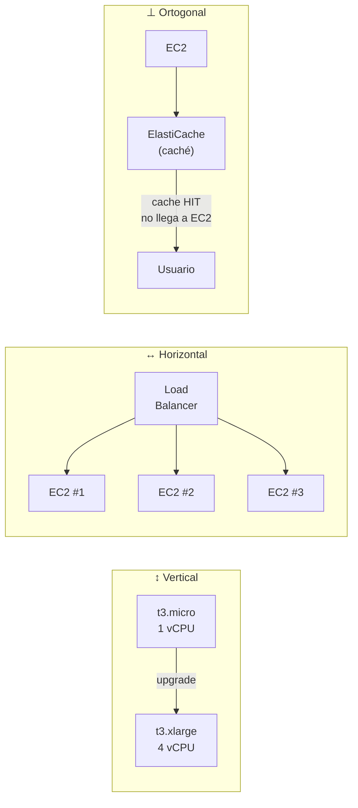

# Amazon EC2: Elastic Compute Cloud

Los servicios de cómputo son la columna vertebral de AWS — son los que realmente *ejecutan* el
código de tus aplicaciones. Dentro de esta categoría, **Amazon EC2** (Elastic Compute Cloud) es
el servicio más fundamental y más utilizado de toda la plataforma. Entender EC2 en profundidad
no es solo aprender a lanzar servidores: es entender el modelo mental sobre el que se construye
prácticamente toda arquitectura en la nube.

---

## Qué Significa el Nombre

El nombre *Elastic Compute Cloud* no es arbitrario. Cada palabra describe una característica
esencial del servicio:

### "Elastic" — La Convención de Nomenclatura de AWS

Si exploras los servicios de AWS notarás que "Elastic" aparece repetidamente: EBS (Elastic Block
Store), ELB (Elastic Load Balancing), ECS (Elastic Container Service), ElastiCache... No es
casualidad — es una **convención de nomenclatura deliberada** que AWS usa para señalar que un
servicio tiene capacidad de escalar dinámicamente. Cuando ves "Elastic" en un nombre de servicio
de AWS, significa que ese servicio puede crecer y encogerse según la demanda sin intervención manual.

En EC2 específicamente, la elasticidad se refiere a la capacidad de ajustar la infraestructura
de cómputo en respuesta a cambios en la carga de trabajo. Hay tres dimensiones de escalado:

**Escalado Vertical** (Scale Up / Scale Down) — Aumentar o disminuir los recursos de una misma
máquina. Si tu instancia `t3.micro` se queda corta de CPU, la cambias por una `t3.large` con más
recursos. Es simple de entender pero tiene un límite físico: hay un tamaño máximo de instancia,
y redimensionar una instancia generalmente requiere reiniciarla.

**Escalado Horizontal** (Scale Out / Scale In) — Agregar o quitar instancias idénticas en
paralelo. En lugar de hacer una máquina más grande, añades más máquinas del mismo tamaño. Es
el enfoque nativo de la nube: en lugar de un servidor grande, diez servidores medianos detrás
de un Load Balancer. No tiene el límite de tamaño del escalado vertical y permite alta
disponibilidad porque si una instancia falla, las demás siguen operando.

**Escalado Ortogonal** — En lugar de escalar la misma pieza de la arquitectura, introduces
componentes especializados para aliviar la carga. Por ejemplo: si tu servidor EC2 se satura
porque responde las mismas queries de base de datos repetidamente, agregas una capa de caché
(ElastiCache) en lugar de hacer EC2 más grande. No escalas el servidor — cambias la arquitectura.
Es la forma más eficiente de escalar pero requiere entender dónde está el cuello de botella real.



### "Compute" — El Propósito

*Compute* (cómputo) hace referencia a la capacidad de procesamiento: ejecutar instrucciones,
correr programas, calcular resultados. EC2 proporciona esa capacidad en forma de servidores
virtuales — máquinas que procesan, calculan y ejecutan el código de tu aplicación.

### "Cloud" — La Virtualización

El *Cloud* representa que no hay hardware físico dedicado para ti. EC2 funciona sobre
virtualización: los servidores físicos de AWS están divididos en múltiples máquinas virtuales
completamente aisladas entre sí. Tu instancia EC2 es una de esas máquinas virtuales — tiene
su propia CPU virtual, su propia RAM, su propio disco y su propia interfaz de red, pero comparte
el hardware físico subyacente con otras instancias de otros clientes (el modelo multi-tenant que
vimos en los fundamentos). Esta virtualización es lo que hace posible la elasticidad: es mucho
más rápido crear o destruir una máquina virtual que instalar o desmontar un servidor físico.

---

## Conceptos Clave

Antes de entrar de lleno a operar EC2, es necesario comprender un conjunto de conceptos que
aparecen de forma transversal en prácticamente todo lo que haremos. Estos términos no son
específicos de EC2 — muchos se repiten en otros servicios de AWS — pero EC2 es el contexto
ideal para aprenderlos porque aquí se vuelven concretos y tangibles.

### Instancia

Una **instancia** es una máquina virtual en ejecución dentro de la infraestructura de AWS.
Cuando lanzas una instancia EC2, obtienes un entorno de cómputo completo y aislado: CPU virtual,
RAM, almacenamiento en disco y una interfaz de red con su propia IP privada. Desde tu perspectiva
es indistinguible de un servidor físico — puedes conectarte por SSH, instalar software, ejecutar
procesos, abrir puertos. La diferencia es que ese "servidor" existe como software sobre el
hardware de AWS, lo que significa que puede crearse en segundos, detenerse, redimensionarse o
eliminarse con un clic.

### AMI — Amazon Machine Image

Una **AMI** (Amazon Machine Image, imagen de máquina de Amazon) es la plantilla a partir de la
cual se lanza una instancia. Contiene el sistema operativo preconfigurado, el software base, las
configuraciones del sistema y, opcionalmente, scripts de inicialización. Es el equivalente digital
de un disco de instalación del sistema operativo, pero listo para arrancar instantáneamente.

Existen tres tipos de AMIs:
- **Oficiales de AWS** — Amazon Linux, Ubuntu, Windows Server, RHEL, Debian, SUSE. Mantenidas
  y actualizadas directamente por AWS o por el proveedor del SO.
- **De la comunidad / AWS Marketplace** — Miles de AMIs creadas por terceros, algunas gratuitas
  y otras de pago, con software preinstalado (servidores web, bases de datos, herramientas de
  seguridad).
- **Personalizadas (Custom AMIs)** — Las creas tú a partir de una instancia existente ya
  configurada. Ideal para estandarizar entornos y acelerar el despliegue: lanzas una instancia,
  la configuras exactamente como necesitas, y creas una AMI de ella. A partir de esa AMI puedes
  lanzar cien instancias idénticas en segundos.

Las AMIs también pueden incluir **scripts de lanzamiento** (User Data): código que se ejecuta
automáticamente la primera vez que arranca la instancia, permitiendo instalar paquetes, configurar
servicios o descargar código sin necesidad de conectarse manualmente.

### Regiones y Zonas de Disponibilidad en EC2

Como vimos en los fundamentos, cada recurso de AWS vive en una región específica. En EC2 esto
tiene consecuencias directas: una instancia lanzada en `eu-west-1` (Irlanda) no aparece en
`us-east-1` (Virginia), y su IP, su latencia y su costo son propios de esa región.

Dentro de la región, la instancia se ubica en una **AZ** específica. Esto importa para la
resiliencia: si lanzas todas tus instancias en `eu-west-1a` y esa AZ tiene una interrupción,
todas caen juntas. La buena práctica es distribuir instancias críticas entre al menos dos AZs.

### Tipos de Instancia

Los **tipos de instancia** definen las especificaciones de hardware virtual de la máquina:
cantidad de vCPUs, memoria RAM, tipo de almacenamiento temporal y capacidad de red. AWS ofrece
cientos de combinaciones organizadas en familias por propósito:

Dentro de la categoría de **propósito general** conviven dos series con comportamientos muy
distintos que ilustran bien cómo AWS segmenta sus instancias según el patrón de carga:

| Propósito | Serie | Código | Comportamiento | Caso de uso |
|---|---|---|---|---|
| **General Purpose** | **t** | `t3`, `t4g` | Burstable — CPU variable con créditos | Desarrollo, testing, workloads intermitentes |
| **General Purpose** | **m** | `m6i`, `m7g` | Steady state — CPU constante y predecible | Producción estable, servidores web, APIs |
| **Compute Optimized** | **c** | `c6i`, `c7g` | Máxima CPU sostenida | Procesamiento batch, gaming, encoding |
| **Memory Optimized** | **r** | `r6i`, `r7g` | Alta RAM, CPU moderada | Bases de datos in-memory, caché, SAP |
| **Memory Optimized** | **x** | `x2idn` | RAM masiva a escala extrema | Cargas empresariales en memoria (SAP HANA) |
| **Storage Optimized** | **i** | `i3`, `i4i` | NVMe local ultra rápido | Bases de datos NoSQL, OLTP de alto volumen |
| **Storage Optimized** | **d** | `d3` | HDD de alta densidad | Data warehouses, Hadoop, almacenamiento masivo |
| **Accelerated Computing** | **p** | `p4`, `p5` | GPU — alto cómputo paralelo | Entrenamiento de modelos ML/DL |
| **Accelerated Computing** | **g** | `g5`, `g6` | GPU — optimizada para costo/rendimiento | Inferencia ML, gráficos, streaming de video |

### t vs m — Burstable vs Steady State

Esta es una de las distinciones más importantes para elegir bien y controlar el costo.


**Las instancias `t` (burstable)** tienen una CPU base baja (por ejemplo, 10% en una `t3.micro`)
pero pueden "explotar" hasta el 100% cuando la carga lo requiere. Esto las hace ideales para
cargas que la mayor parte del tiempo están en reposo pero ocasionalmente necesitan potencia
máxima: un entorno de desarrollo que solo trabaja cuando el developer está activo, un servidor
de staging que recibe tráfico esporádico, o un microservicio que procesa jobs cortos con largos
tiempos de espera entre ellos.

**Las instancias `m` (steady state)** ofrecen CPU constante y predecible: lo que ves es lo que
obtienes, sin bonificaciones ni penalizaciones. Son el estándar de facto para entornos de
producción con carga sostenida: servidores web que sirven tráfico continuamente, APIs que deben
responder con latencia consistente o aplicaciones donde los picos de CPU son la norma y no la excepción.

### El Sistema de Créditos CPU

El mecanismo que hace posible el bursting en las instancias `t` es el **sistema de créditos CPU**.
Cada instancia `t` tiene un *baseline* de CPU (un porcentaje que puede usar de forma continua
sin consumir créditos). Cuando el uso de CPU está **por debajo** del baseline, la instancia
acumula créditos. Cuando el uso **supera** el baseline (un burst), consume esos créditos acumulados.


El panel superior muestra el uso de CPU: las zonas rojas son bursts (consumiendo créditos),
las verdes son periodos bajo el baseline (acumulando créditos). El panel inferior muestra el
saldo de créditos en el tiempo — baja durante los bursts y se recupera en los periodos tranquilos.

::: warning Modo `unlimited` y sobrecosto
Si una instancia `t` agota todos sus créditos y el bursting sigue siendo necesario, AWS puede
activar el modo **unlimited** — que permite continuar con el burst pero **cobra por los vCPU-hours
adicionales**. Este es uno de los sobrecostos más silenciosos de AWS: una instancia `t3.micro`
de desarrollo que alguien dejó corriendo una tarea intensiva puede generar una factura inesperada.
Monitorea los créditos con CloudWatch (`CPUCreditBalance`) para detectar este escenario.
:::

### Otras Diferencias por Letra dentro de una Familia

La misma lógica t/m aplica en otras familias: dentro de Memory Optimized, `r` es la opción
estándar para la mayoría de cargas con alta demanda de RAM (bases de datos en memoria, caches
grandes, SAP HANA), mientras que `x` es la variante extrema para organizaciones que necesitan
terabytes de RAM en una sola instancia. En Storage Optimized, `i` prioriza la velocidad de
acceso (NVMe local con latencia de microsegundos, ideal para bases de datos NoSQL de alta
velocidad como Cassandra) mientras que `d` prioriza la densidad y el costo por TB (HDD de
alta capacidad, perfecta para Hadoop o data lakes que no requieren velocidad extrema). En GPU,
`p` está optimizada para el entrenamiento de modelos (operaciones de cómputo masivo en paralelo)
y `g` para inferencia y gráficos (mejor relación rendimiento/costo para modelos ya entrenados).

### Nomenclatura Completa


El nombre de un tipo de instancia sigue la estructura `familia + generación + opciones . tamaño`:

```
c  7  g  n  .  2xlarge
│  │  │  │     └─ Tamaño: nano, micro, small, medium, large, xlarge, 2xlarge, 4xlarge...
│  │  │  └─ Opción de red/EBS: n = alto networking + EBS optimizado
│  │  └─ Opción de procesador: g = Graviton (ARM de AWS)
│  └─ Generación (mayor número = más reciente y eficiente)
└─ Familia: c = compute optimized
```

Las **opciones** son sufijos que indican características adicionales del procesador o la red:

| Letra | Significado |
|---|---|
| `a` | Procesador AMD EPYC |
| `i` | Procesador Intel (por defecto en muchas familias) |
| `g` | Procesador AWS Graviton (ARM) — hasta 40% mejor precio/rendimiento |
| `n` | Networking mejorado + EBS optimizado de alta velocidad |
| `d` | Almacenamiento NVMe local incluido (instance store) |
| `z` | Alta frecuencia de reloj del procesador |

Cuando un tipo de instancia **no tiene opciones** (ej: `m6i.large`) significa que usa el
procesador por defecto de esa generación sin características de red o almacenamiento adicionales.
Es la variante más simple y generalmente la de menor costo dentro de su familia y tamaño.

### Listar Tipos de Instancia con la CLI

```bash
# Ver todos los tipos de instancia disponibles en la región activa
aws ec2 describe-instance-types \
  --query "InstanceTypes[].InstanceType" \
  --output table

# Filtrar solo las instancias de la familia t3
aws ec2 describe-instance-types \
  --filters "Name=instance-type,Values=t3.*" \
  --query "InstanceTypes[].[InstanceType, VCpuInfo.DefaultVCpus, MemoryInfo.SizeInMiB]" \
  --output table

# Ver specs completos de un tipo específico
aws ec2 describe-instance-types \
  --instance-types t3.micro \
  --query "InstanceTypes[0].{vCPUs:VCpuInfo.DefaultVCpus, RAM_MiB:MemoryInfo.SizeInMiB, Network:NetworkInfo.NetworkPerformance}" \
  --output table
```

El comando `describe-instance-types` consulta directamente la API de EC2 para obtener las
especificaciones actualizadas de cualquier tipo de instancia — útil para scripts que necesitan
verificar recursos disponibles antes de lanzar infraestructura de forma automatizada.

::: info Referencias de tipos de instancia
- Comparativa visual con filtros: [aws.amazon.com/ec2/instance-types](https://aws.amazon.com/ec2/instance-types/)
- Nomenclatura oficial detallada: [docs.aws.amazon.com/ec2/latest/instancetypes/instance-type-names.html](https://docs.aws.amazon.com/ec2/latest/instancetypes/instance-type-names.html)
:::

---

## El Ciclo de Vida de una Instancia

Una instancia EC2 no existe en solo dos estados (encendida/apagada) — tiene un ciclo de vida
completo con estados bien definidos. Entenderlo es esencial para gestionar costos y operar
correctamente.


| Estado | ¿Qué ocurre? | ¿Se cobra? |
|---|---|---|
| **Pending** | AWS asigna recursos y arranca la instancia | ❌ No |
| **Running** | Instancia activa y accesible | ✅ Sí |
| **Stopping** | La instancia se está deteniendo | ❌ No |
| **Stopped** | Apagada pero no eliminada — los datos en EBS se conservan | ❌ No (instancia) ⚠️ Sí (EBS y Elastic IP) |
| **Shutting-down** | En proceso de eliminación irreversible | ❌ No |
| **Terminated** | Eliminada definitivamente, no recuperable | ❌ No |

La analogía con un computador real ayuda a entender la diferencia crítica entre **Stop** y
**Terminate**: *Stop* es apagar el computador — el disco duro (EBS) conserva todos sus datos y
puedes volverlo a encender en cualquier momento. *Terminate* es destruir físicamente el
computador y su disco — todo se pierde de forma irreversible.

::: warning Costos en estado Stopped
Detener una instancia no elimina todos los costos. El volumen **EBS** (disco) sigue existiendo
y se sigue cobrando por GB mientras la instancia esté parada. Lo mismo ocurre con las
**Elastic IPs** reservadas: si tienes una IP estática asignada a una instancia detenida,
AWS la cobra para incentivar que liberes IPs que no estás usando.
:::

**Casos de uso del ciclo de vida:**
- **Entornos de desarrollo**: detén las instancias fuera del horario laboral para eliminar el
  costo de cómputo, conservando el disco con tu trabajo. Un script o Lambda puede automatizar
  esto según horario.
- **Instancias de procesamiento batch**: lanza, procesa, termina. Pagas solo por el tiempo de
  trabajo real.
- **Actualizaciones con cero downtime**: lanza una nueva instancia con la versión actualizada,
  valida que funciona, cambia el Load Balancer hacia ella, termina la antigua.

::: info Documentación oficial del ciclo de vida
[docs.aws.amazon.com/AWSEC2/latest/UserGuide/ec2-instance-lifecycle.html](https://docs.aws.amazon.com/AWSEC2/latest/UserGuide/ec2-instance-lifecycle.html)
:::

---

## Cómo Desplegar una Instancia

### 1. Navegar a EC2

Desde el buscador de la consola escribe "EC2" y selecciona el servicio:


Desde la página de inicio del servicio, haz clic en **Launch instance**:


### 2. Nombre y AMI


El asistente de lanzamiento comienza con dos decisiones fundamentales:

**Nombre** — Etiqueta identificadora de la instancia (ej: `web-server-01`). No tiene impacto
técnico pero es esencial para identificar recursos en proyectos con múltiples instancias.

**AMI** — La plantilla del sistema operativo. En el panel *Quick Start* aparecen las más usadas:
Amazon Linux, Ubuntu, Windows, Red Hat, SUSE y Debian. Cada una tiene su propia variante
**Free Tier eligible** marcada con etiqueta verde. El resumen lateral muestra el AMI ID
exacto seleccionado (`ami-0642...`).

### 3. Key Pair — La Llave de Acceso SSH

Antes de configurar la red, necesitas crear o seleccionar un **Key Pair** (par de claves)
— el mecanismo que usarás para conectarte a la instancia por SSH.

Haz clic en **Create new key pair**:


- **Key pair name** — El nombre que le darás al archivo (ej: `My-Key`)
- **Key pair type** — RSA es el estándar más compatible; ED25519 es más moderno y seguro
- **Private key file format** — `.pem` para OpenSSH (Linux/Mac/Windows con OpenSSH); `.ppk`
  para PuTTY en Windows

Al hacer clic en *Create key pair*, el archivo `.pem` se descarga automáticamente a tu equipo.
**Guárdalo en un lugar seguro — AWS no te lo volverá a mostrar**. Sin este archivo no podrás
conectarte a la instancia.

### 4. Red y Seguridad


Con el Key Pair seleccionado, la sección de red muestra:

**Network / VPC** — La red virtual donde vivirá la instancia. Por defecto usa la VPC por
defecto de la región.

**Subnet** — La subred específica dentro de la VPC. `No preference` deja que AWS elija la
AZ óptima.

**Auto-assign public IP** — Habilitado por defecto en subnets públicas. Asigna una IP pública
dinámica para acceso desde Internet (esta IP cambia cada vez que se detiene y reinicia la instancia).

**Firewall (Security Groups)** — Un Security Group es un firewall virtual que controla qué
tráfico puede entrar y salir de la instancia. En el asistente crea uno nuevo con reglas básicas:
- **SSH (puerto 22)** desde `My IP`: permite conectarte tú desde tu IP actual
- **HTTP (puerto 80)** y **HTTPS (puerto 443)**: opcionales, para servidores web

**Configure storage** — Disco raíz de la instancia. Por defecto 8 GB de tipo gp3 (SSD de
propósito general). Puedes aumentar el tamaño aquí antes de lanzar.

### 5. Lanzar

Con todo configurado, el panel **Summary** en la derecha confirma las elecciones: AMI,
tipo de instancia, security group y almacenamiento. Haz clic en **Launch instance**:


AWS aprovisiona los recursos (típicamente entre 30 y 90 segundos) y muestra una barra de progreso.


La pantalla de éxito confirma el lanzamiento e incluye acciones sugeridas como configurar
alertas de costo, conectar una base de datos RDS o activar monitoreo detallado.

### 6. Ver las Instancias

Haz clic en **View all instances** o navega a **EC2 → Instances**:


La tabla muestra todas las instancias de la región con sus atributos principales: ID, nombre,
estado, tipo, AZ, IP pública y privada, key pair asociado y hora de lanzamiento. Al seleccionar
una instancia aparece el panel de detalle inferior con toda su información técnica:


---

## Conectarse a una Instancia por SSH

**SSH** (Secure Shell) es el protocolo estándar para conectarse de forma segura a un servidor
Linux de forma remota. Cifra toda la comunicación entre tu terminal y la instancia, y usa el
par de claves (Key Pair) para autenticarte sin contraseña.

La estructura del comando es:

```bash
ssh -i <ruta-al-archivo-pem> <usuario>@<ip-publica>
```

Con los valores reales del ejemplo:

```bash
ssh -i C:\Users\<tuUsuario>\Downloads\My-Key.pem ec2-user@34.240.27.150
```

- `-i` indica el archivo de identidad (la clave privada `.pem`)
- La **IP pública** la obtienes de la columna *Public IPv4* en la lista de instancias
- El **usuario por defecto** depende del sistema operativo de la AMI:

| Sistema Operativo | Usuario por defecto |
|---|---|
| Amazon Linux 2 / 2023 | `ec2-user` |
| Ubuntu | `ubuntu` |
| Debian | `admin` |
| RHEL / CentOS | `ec2-user` o `root` |
| SUSE | `ec2-user` o `root` |
| Windows Server | `Administrator` (vía RDP, no SSH) |


Al conectarte exitosamente verás el banner de Amazon Linux 2023 y el prompt
`[ec2-user@ip-172-31-4-140 ~]$` — estás dentro del servidor.

::: tip Primer acceso en Linux/Mac
En sistemas Unix el archivo `.pem` requiere permisos restrictivos antes de poder usarse:
```bash
chmod 400 My-Key.pem
ssh -i My-Key.pem ec2-user@<ip-publica>
```
:::

### Verificar el Sistema

Una vez conectado puedes verificar las especificaciones del servidor con comandos estándar de Linux:


```bash
cat /etc/os-release      # información del sistema operativo
```


```bash
nproc                              # número de CPUs virtuales
uname -m                           # arquitectura del procesador (x86_64)
lscpu | grep Architecture          # arquitectura detallada
free -h                            # memoria RAM disponible
cat /proc/meminfo | grep MemTotal  # memoria total exacta
```

Estos comandos confirman que la instancia tiene exactamente los recursos que configuraste
en el tipo de instancia. En el ejemplo: t2.micro con 1 vCPU y ~961 MB de RAM.

---

## Gestión del Estado de una Instancia

Con la instancia seleccionada en la lista, el botón **Instance state** despliega las acciones
disponibles sobre el ciclo de vida:


### Stop — Detener


Detiene la instancia de forma limpia (ejecuta el proceso de shutdown del SO). La instancia pasa
a estado `stopped` — el disco EBS conserva todos los datos y puedes reiniciarla cuando quieras.

El aviso amarillo del diálogo es importante: aunque dejes de pagar por la instancia, **sigues
pagando por los volúmenes EBS asociados y por cualquier Elastic IP reservada**. Si quieres
eliminar todo el costo, debes terminar (no solo detener) la instancia.

La opción *Skip OS shutdown* salta el cierre ordenado del sistema operativo — solo úsala en
emergencias, ya que puede corromper datos en disco.

### Terminate — Eliminar


Elimina la instancia de forma permanente e irreversible. Por defecto, el volumen EBS raíz
también se elimina (comportamiento configurable). El botón del diálogo dice explícitamente
*"Terminate (delete)"* y advierte que la acción no puede deshacerse.

::: danger Terminate es irreversible
A diferencia de Stop, **Terminate no tiene marcha atrás**. La instancia y su disco raíz
desaparecen permanentemente. Activa **Termination Protection** en instancias de producción
para exigir que se desactive explícitamente antes de poder terminarlas.
:::

### Reboot — Reiniciar


Reinicia el sistema operativo de la instancia. A diferencia de Stop + Start, el Reboot **no
cambia la IP pública** de la instancia, lo que lo hace preferible para reiniciar servicios
sin perder la dirección de red.
